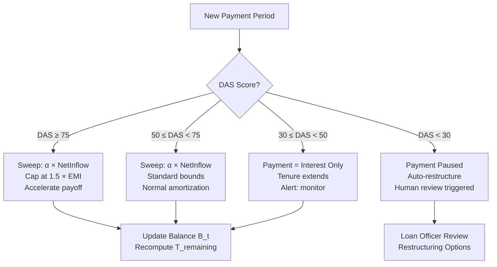
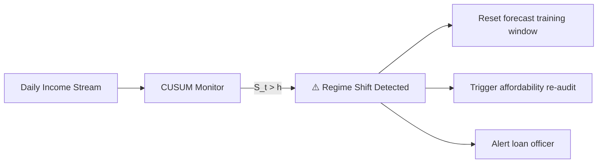

# RaahPay — Algorithm Deep Dive

> Mathematical foundations and algorithmic approaches for each module in the analytics pipeline.

---

## Table of Contents
1. [STL Seasonal Decomposition](#1-stl-seasonal-decomposition)
2. [Cash Flow Forecasting](#2-cash-flow-forecasting)
3. [Dynamic Affordability Scoring](#3-dynamic-affordability-scoring)
4. [Dynamic Repayment Scheduling](#4-dynamic-repayment-scheduling)
5. [Hidden Markov Models for Financial States](#5-hidden-markov-models-for-financial-states)
6. [Survival Analysis for Default Prediction](#6-survival-analysis-for-default-prediction)
7. [Change Point Detection](#7-change-point-detection)

---

## 1. STL Seasonal Decomposition

### Why It Matters for Microloans

Borrower income is a mixture of three forces:
- **Trend** ($T_t$): Gradual business growth or contraction
- **Seasonality** ($S_t$): Predictable weekly market days, monthly pay cycles, annual harvest peaks
- **Residual** ($R_t$): Random shocks — illness, weather, equipment failure

If we peg repayments to raw income, we mistake seasonal troughs for permanent decline. STL separates signal from noise.

### Additive vs Multiplicative

| Model | Formula | When to Use |
|:------|:--------|:------------|
| **Additive** | $Y_t = T_t + S_t + R_t$ | Seasonal amplitude stays constant (rare in practice) |
| **Multiplicative** | $Y_t = T_t \times S_t \times R_t$ | Seasonal swings scale with income level (typical for growing businesses) |

> [!TIP]
> For multiplicative decomposition, apply log transform first: $\ln(Y_t) = \ln(T_t) + \ln(S_t) + \ln(R_t)$, then use additive STL.

### STL Algorithm (Cleveland et al., 1990)

#### Inner Loop (per iteration $k$):
1. **Detrend**: $Y_t^{(k)} - \hat{T}_t^{(k-1)}$
2. **Cycle-Subseries Smoothing**: For each periodic subseries (e.g., all Mondays), apply Loess with window $n_{(s)}$ → preliminary seasonal $C_t^{(k)}$
3. **Low-Pass Filter**: Triple moving average + Loess → extract low-frequency leakage $L_t^{(k)}$
4. **Seasonal**: $\hat{S}_t^{(k)} = C_t^{(k)} - L_t^{(k)}$
5. **Deseasonalize**: $D_t^{(k)} = Y_t - \hat{S}_t^{(k)}$
6. **Trend**: Loess smooth $D_t^{(k)}$ with window $n_{(t)}$ → updated $\hat{T}_t^{(k)}$

#### Outer Loop (Robustness):
Computes residual weights to downweight outliers (e.g., a one-time asset sale):
$$h = 6 \cdot \text{median}(|R_t|)$$
$$w_t = B\!\left(\frac{|R_t|}{h}\right), \quad B(u) = \begin{cases} (1 - u^2)^2 & 0 \le u < 1 \\ 0 & u \ge 1 \end{cases}$$

### Python Implementation
```python
from statsmodels.tsa.seasonal import STL

def decompose_income(daily_income_series, period=7):
    """
    period=7  → weekly cycles (market days, weekends)
    period=30 → monthly cycles (salary, rent)
    """
    stl = STL(daily_income_series, period=period, seasonal=13, robust=True)
    result = stl.fit()
    return {
        "trend": result.trend,
        "seasonal": result.seasonal,
        "residual": result.resid
    }
```

### What Each Component Tells the Lender

| Component | Interpretation | Action |
|:----------|:--------------|:-------|
| **Trend ↑** | Business is growing | Can offer larger loans, shorter tenure |
| **Trend ↓** | Business is declining | Reduce exposure, increase monitoring frequency |
| **Seasonal amplitude** | How much income swings | Scale payment bounds proportionally |
| **Residual spikes** | One-off shocks | Don't overreact — wait for trend confirmation |

---

## 2. Cash Flow Forecasting

### The Core Question
> "What will this borrower's cash availability look like over the next 30-90 days, and how confident are we?"

We need **quantile forecasts** — not just the expected value, but conservative lower bounds ($P_{10}$) to avoid over-scheduling payments.

### Method 1: Quantile Gradient Boosting (LightGBM)

Instead of predicting $\mathbb{E}[C_{t+h}]$, we minimize the **pinball loss** for quantile $\tau$:

$$\mathcal{L}_\tau(y, \hat{y}) = \begin{cases} \tau \cdot (y - \hat{y}) & \text{if } y \ge \hat{y} \\ (1-\tau) \cdot (\hat{y} - y) & \text{if } y < \hat{y} \end{cases}$$

Train three models: $\tau = 0.10$ (conservative), $\tau = 0.50$ (expected), $\tau = 0.90$ (optimistic).

#### Feature Engineering

| Feature | Formula | Purpose |
|:--------|:--------|:--------|
| Rolling Inflow (7d, 14d, 30d) | $\sum_{k=0}^{W-1} \text{Inflow}_{t-k}$ | Short-term cash velocity |
| Coefficient of Variation | $CV_W = \sigma / (\mu + \epsilon)$ | Income predictability |
| Zero-Cash Day Ratio | $\frac{1}{W}\sum \mathbb{1}(\text{Inflow}_{t-k} = 0)$ | Intermittency level |
| Day-of-Week Encoding | One-hot / cyclical sin/cos | Weekly market patterns |
| Month-of-Year Encoding | Cyclical sin/cos | Annual seasonality |
| Lag Features | $Y_{t-1}, Y_{t-7}, Y_{t-14}, Y_{t-30}$ | Autoregressive memory |
| Trend Slope | Linear regression on last 30 days | Growth/decline direction |
| Counterparty Entropy | $-\sum p_i \log_2(p_i)$ | Income source diversification |

### Method 2: Croston's Method (for Intermittent Income)

Many micro-entrepreneurs have **zero-income days** punctuated by bursts. Standard exponential smoothing fails here.

Croston separates:
- **Magnitude** ($z_t$): Size of non-zero transactions
- **Inter-arrival** ($p_t$): Gaps between transactions

$$\hat{z}_t = \alpha \cdot y_t + (1 - \alpha) \cdot \hat{z}_{t-1}$$
$$\hat{p}_t = \alpha \cdot k + (1 - \alpha) \cdot \hat{p}_{t-1}$$
$$\hat{Y}_{t+1} = \frac{\hat{z}_t}{\hat{p}_t}$$

> [!NOTE]
> Use Croston for borrowers with >40% zero-income days (gig workers, fishermen). Use Quantile GBDT for daily earners (vendors, retail shops).

---

## 3. Dynamic Affordability Scoring

### The DAS Framework

The Dynamic Affordability Score ($DAS_t \in [0, 100]$) answers: **"How much can this borrower safely repay right now?"**

```
[ Total Forecasted Inflows (P10 conservative) ]
              |
   − [ Essential Fixed Expenses ]
   − [ Volatility Haircut (downside semi-variance) ]
   − [ Savings Buffer Replenishment Need ]
              |
              v
 ═══════════════════════════════════════
 [ Maximum Safe Repayment Capacity ]
 ═══════════════════════════════════════
```

### Sub-Components

#### A. Downside Semi-Variance (Asymmetric Volatility)
Standard deviation penalizes upward windfalls equally to downward shocks. For lending, only **downside shortfall** matters:

$$SV_{down} = \sqrt{\frac{1}{T} \sum_{t=1}^T \min(0,\ I_t - \mu_I)^2}$$

$$\nu_t = \frac{SV_{down,t}}{\mu_{I,t} + \epsilon} \quad \text{(Downside Volatility Index)}$$

#### B. Expense Categorization

$$E_t = E_{ess,t} + E_{disc,t}$$

- $E_{ess}$: Rent, utilities, food, minimum inventory — **non-negotiable**
- $E_{disc}$: Entertainment, luxury, non-essential travel — **compressible**

**Discretionary Flexibility Ratio**:
$$\phi_t = \frac{E_{disc,t}}{E_t + \epsilon} \in [0, 1]$$

Higher $\phi_t$ = borrower can cut spending if shocked.

#### C. Dynamic Savings Buffer

$$B_{req,t} = \kappa \cdot SV_{down,t} \cdot \sqrt{\Delta t_{shock}}$$

Where $\kappa \approx 1.96$ (95% confidence), $\Delta t_{shock}$ = expected recovery time (e.g., 14 days).

**Buffer Health Ratio**:
$$\theta_t = \min\left(1.0,\ \frac{\text{Current Balance}_t}{B_{req,t}}\right)$$

#### D. Dynamic Debt Service Coverage Ratio (D-DSCR)

$$\text{D-DSCR}_t = \frac{\hat{I}_t^{P_{10}} - E_{ess,t} - \lambda \cdot \max(0,\ B_{req,t} - \text{Balance}_t)}{P_t}$$

Where $\hat{I}_t^{P_{10}}$ is the conservative forecasted inflow and $P_t$ is the proposed payment.

#### E. Composite Score

$$DAS_t = 100 \times \left[ w_1 \cdot \sigma\!\left(\frac{\text{D-DSCR}_t - 1.0}{\tau_1}\right) + w_2 \cdot \theta_t + w_3 \cdot \phi_t + w_4 \cdot (1 - \nu_t) \right]$$

Where $\sigma(x) = \frac{1}{1 + e^{-x}}$ and $\sum w_i = 1.0$.

| DAS Range | Status | Repayment Action |
|:----------|:-------|:----------------|
| **≥ 75** | 🟢 High Affordability | Accelerated payoff opportunity |
| **50–74** | 🟡 Moderate | Standard scheduled repayment |
| **30–49** | 🟠 Stressed | Reduce to interest-only or payment floor |
| **< 30** | 🔴 Critical | Automatic pause / restructure trigger |

---

## 4. Dynamic Repayment Scheduling

### The Core Algorithm: Bounded Adaptive Sweep

Traditional EMI:
$$EMI = \frac{L \cdot r \cdot (1+r)^n}{(1+r)^n - 1}$$

**RaahPay Dynamic Installment**:
$$p_t = \text{clip}\!\left(\alpha \cdot \text{NetInflow}_t \cdot S_t,\ I_{\min},\ I_{\max}\right)$$

Where:
- $\alpha = 0.20$ — sweep 20% of net discretionary inflow
- $S_t$ — seasonal adjustment factor
- $I_{\min} = \max(\text{Interest}_t,\ 0.5 \times EMI)$ — floor prevents negative amortization
- $I_{\max} = 1.5 \times EMI$ — cap prevents borrower liquidity shock

### Balance Dynamics

$$B_t = B_{t-1}(1 + r_t) - p_t$$
$$B_0 = L_0, \quad B_T = 0 \text{ (terminal clearance)}$$

### Tenure Adjustment

Remaining tenure dynamically floats:
$$T_{remaining} = \left\lceil \frac{B_t}{\bar{p}_{recent}} \right\rceil$$

Subject to: $T_{remaining} \le 1.5 \times T_{original}$ (maximum extension cap).

### Optimization Objective (Advanced)

For full optimization, minimize:

$$\mathcal{J}(\mathbf{p}) = \underbrace{w_1 \sum_t \max(0,\ p_t - \gamma \hat{C}_t^{P_{10}})^2}_{\text{Borrower Distress}} + \underbrace{w_2 \sum_t t \cdot \frac{p_t}{(1+\delta)^t}}_{\text{Lender Capital Velocity}} + \underbrace{w_3 \sum_t (p_t - p_{t-1})^2}_{\text{Payment Smoothness}}$$

### Decision Flow



---

## 5. Hidden Markov Models for Financial States

### 5-State Architecture

A borrower's financial health shifts between **latent regimes** before showing up in formal delinquency:

```mermaid
stateDiagram-v2
    [*] --> Thriving
    Thriving --> Stable: Minor income dip
    Stable --> Stressed: Cash buffer depleted
    Stressed --> Deteriorating: Sustained outflow > inflow
    Stressed --> Recovering: External support or season change
    Recovering --> Stable: Sustained recovery
    Deteriorating --> Default: Missed 3+ payments
    Thriving --> Thriving: Surplus accumulating
    Stable --> Thriving: Business growth
```

### Model Specification

$$\lambda = (\mathbf{A}, \mathbf{B}, \boldsymbol{\pi})$$

**Transition Matrix** $\mathbf{A} \in \mathbb{R}^{5 \times 5}$:
$$a_{ij} = P(Z_t = S_j \mid Z_{t-1} = S_i)$$

**Observation Vector** $\mathbf{x}_t \in \mathbb{R}^4$:
$$\mathbf{x}_t = \begin{bmatrix} \text{Net Cash Flow Ratio} \\ \text{Liquidity Depletion Rate} \\ \text{Essential Expense Share} \\ \text{Transaction Velocity} \end{bmatrix}$$

**Emission Model** (Gaussian per state):
$$\mathbf{x}_t \mid Z_t = S_j \sim \mathcal{N}(\boldsymbol{\mu}_j, \boldsymbol{\Sigma}_j)$$

### Inference

| Algorithm | Purpose | Complexity |
|:----------|:--------|:-----------|
| **Forward-Backward** | Current state belief $P(Z_t = S_k \mid \mathbf{x}_{1:t})$ | $O(TK^2)$ |
| **Viterbi** | Most probable state sequence | $O(TK^2)$ |
| **Baum-Welch (EM)** | Learn parameters from unlabeled data | Iterative |

### Policy Rules

| Condition | Action |
|:----------|:-------|
| $P(\text{Stressed}) > 0.60$ | Cap payment at interest-only floor |
| $P(\text{Deteriorating}) > 0.70$ | Pause auto-debit, trigger human review |
| $P(\text{Thriving}) > 0.80$ | Prompt: "Pay extra \$15 to save \$8 in interest" |
| $P(\text{Recovering}) > 0.50$ | Gradually restore standard sweep percentage |

---

## 6. Survival Analysis for Default Prediction

### Why Not Binary Classification?

Binary models ($y \in \{0, 1\}$) answer "will they default?" but not **"when?"**. Also, active loans that haven't defaulted yet are **right-censored** — not the same as "will never default."

Survival analysis models **time-to-event** $T$:
- **Survival Function**: $S(t) = P(T > t)$
- **Hazard Function**: $\lambda(t) = \frac{f(t)}{S(t)}$ — instantaneous default rate

### Cox Proportional Hazards (Time-Varying)

$$\lambda(t \mid \mathbf{x}(t)) = \lambda_0(t) \cdot \exp(\boldsymbol{\beta}^T \mathbf{x}(t))$$

Where $\mathbf{x}(t)$ includes time-varying covariates: rolling CV, current DAS, HMM state probabilities.

### Multi-Horizon Default Probability

$$P(\text{Default in } [t, t+\Delta t] \mid T > t) = 1 - \exp\!\left(-\int_t^{t+\Delta t} \lambda(u \mid \mathbf{x}(u))\, du\right)$$

> [!TIP]
> Use `lifelines` library in Python for quick Cox PH implementation: `from lifelines import CoxTimeVaryingFitter`.

---

## 7. Change Point Detection

### Purpose
Detect **structural regime shifts** — loss of a key customer, onset of illness, business disruption — that invalidate historical patterns.

### Method 1: CUSUM (Online, Real-Time)

Monitors cumulative deviations from expected mean $\mu_0$:

$$S_t = \max\!\left(0,\ S_{t-1} + (\mu_0 - k - x_t)\right)$$

**Alert** when $S_t > h$ (calibrated threshold).

- $k = \delta/2$ is the allowance (half the minimum detectable shift)
- $h$ controls false alarm rate (higher $h$ = fewer false alarms, slower detection)

### Method 2: PELT (Offline, Retrospective)

Globally optimal segmentation minimizing:

$$\min_{\boldsymbol{\tau}} \left\{ \sum_{i=1}^{m+1} \mathcal{C}(y_{(\tau_{i-1}+1):\tau_i}) + \beta m \right\}$$

Where $\mathcal{C}$ is segment cost (negative log-likelihood) and $\beta m$ penalizes number of changepoints.

Expected runtime: $O(n)$ with pruning.

### Method 3: Bayesian Online CPD (BOCPD)

Maintains probability distribution over **run length** $r_t$ (time since last changepoint):

$$P(r_t \mid \mathbf{x}_{1:t}) \propto P(\mathbf{x}_t \mid r_{t-1}, \mathbf{x}^{(r)}) \cdot P(r_t \mid r_{t-1}) \cdot P(r_{t-1} \mid \mathbf{x}_{1:t-1})$$

When $P(r_t = 0) > 0.50$ → changepoint detected → reset forecasting window.

### Application in RaahPay



> [!IMPORTANT]
> **Key insight**: Without change point detection, the forecaster keeps using stale historical patterns after a shock. BOCPD resets the learning window instantly, preventing the system from scheduling payments based on obsolete income expectations.

---

## Algorithm Selection Guide

| Borrower Profile | Forecasting | Decomposition | CPD | Risk Model |
|:----------------|:------------|:-------------|:----|:-----------|
| **Daily earner** (vendor, shop) | Quantile GBDT | STL (period=7) | CUSUM | LightGBM + SHAP |
| **Intermittent earner** (gig, fishing) | Croston/TSB | STL (period=7) | CUSUM | LightGBM + SHAP |
| **Seasonal earner** (farmer) | Quantile GBDT | STL (period=30 or 365) | PELT | Cox PH Survival |
| **Mixed/uncertain** | Ensemble | STL (multi-period) | BOCPD | EBM (glass-box) |
