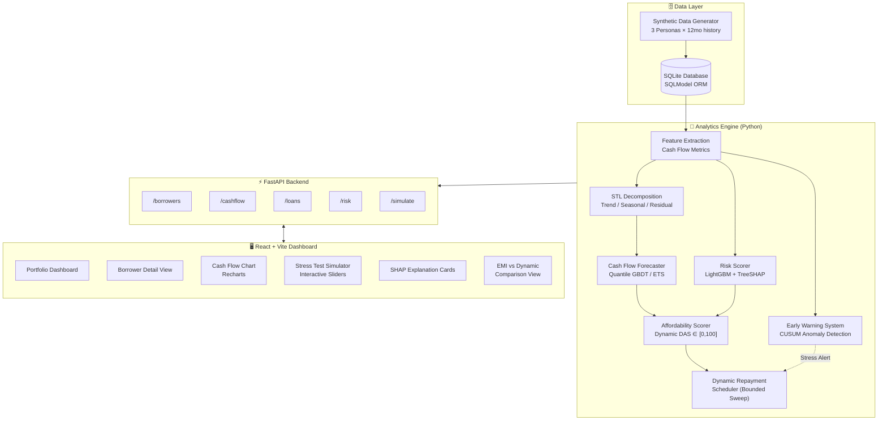
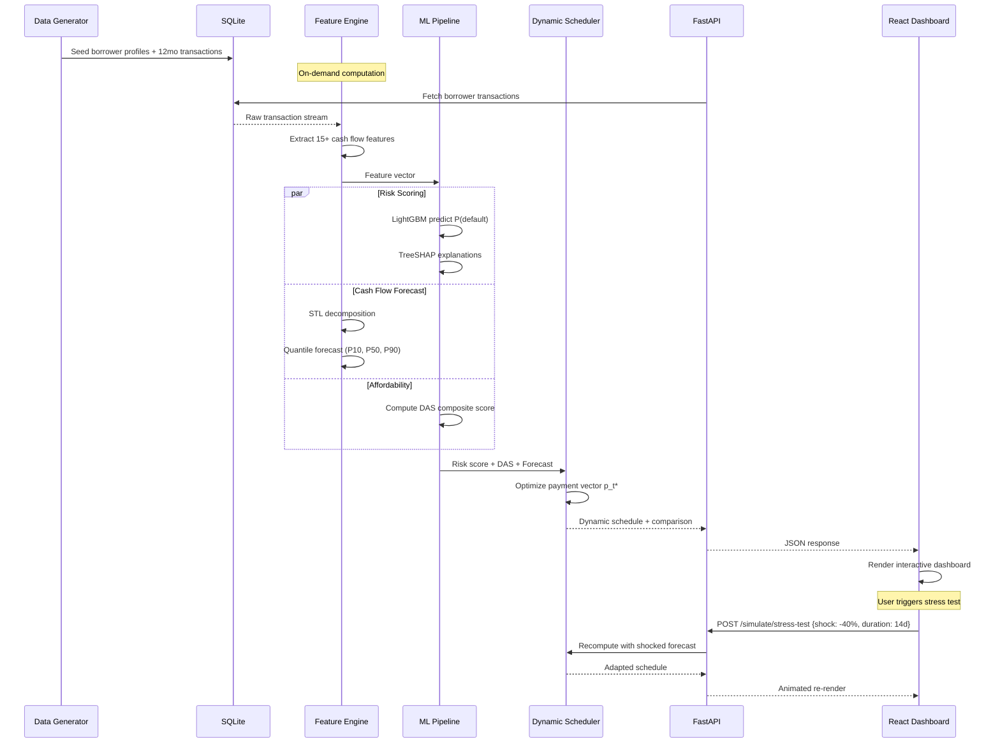
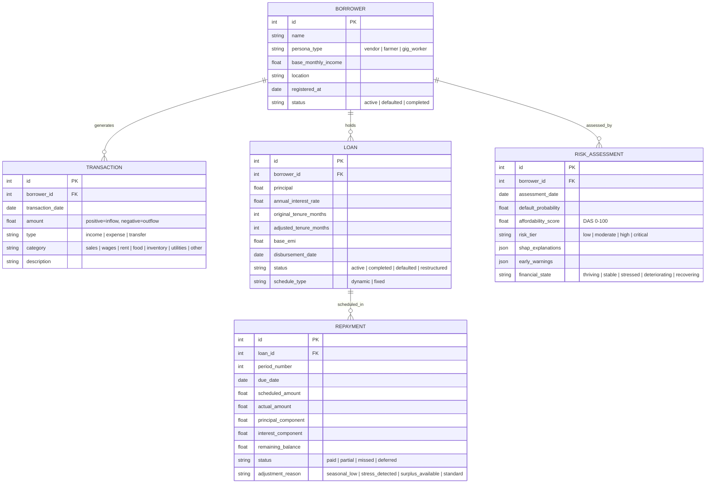
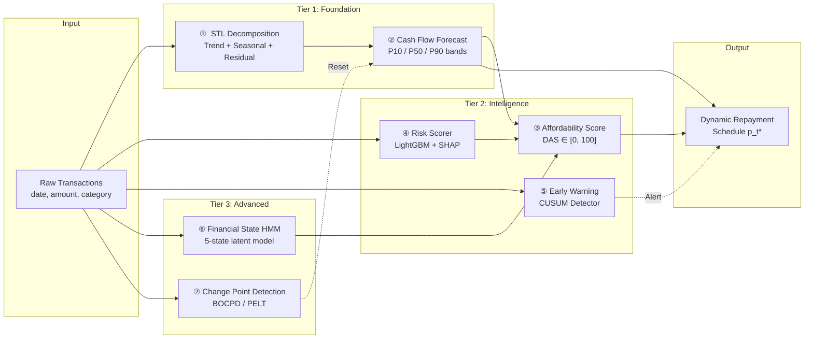
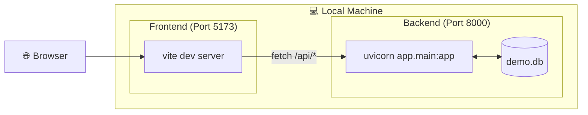

# FlowLend — System Architecture

> Complete technical architecture for the Dynamic Microloan Repayment & Cash-Flow Planning system.

---

## High-Level System Architecture



---

## Data Flow Pipeline



---

## Database Schema



---

## Analytical Pipeline — 7-Module Architecture

The analytics engine processes raw transaction data through a layered pipeline where each module's output feeds downstream consumers:



### Module Interaction Matrix

| Module | Primary Input | Mechanism | Primary Output | Consumers |
|:-------|:-------------|:----------|:--------------|:----------|
| **① STL Decomposition** | Daily income series | Loess regression (seasonal + trend) | Trend $T_t$, Seasonal $S_t$, Residual $R_t$ | ② Forecaster |
| **② Cash Flow Forecast** | $T_t, S_t$, lag features | Quantile LightGBM or Holt-Winters ETS | $\hat{C}_t^{P_{10}}, \hat{C}_t^{P_{50}}, \hat{C}_t^{P_{90}}$ | ③ Affordability, ④ Scheduler |
| **③ Affordability Score** | Forecast, risk score, HMM state | D-DSCR + buffer health + volatility composite | $DAS_t \in [0, 100]$ | Scheduler, Dashboard |
| **④ Risk Scorer** | 15+ engineered features | LightGBM + TreeSHAP | $P(\text{default})$, reason codes | ③ Affordability, Dashboard |
| **⑤ Early Warning** | Daily balance stream | CUSUM statistic $S_t > h$ | Binary stress alert | Scheduler (triggers reduction) |
| **⑥ HMM States** | Multi-dim observation vector | Forward-Backward, Gaussian emissions | $P(Z_t = S_k)$ for 5 states | ③ Affordability, Policy rules |
| **⑦ Change Point Detection** | Income/balance series | BOCPD run-length posterior | Changepoint alarm $\tau$ | ② Forecast (resets training window) |

---

## Component Architecture — Backend

```
backend/
├── app/
│   ├── __init__.py
│   ├── main.py                    # FastAPI app factory, CORS, lifespan
│   │
│   ├── core/
│   │   ├── config.py              # Settings (DB path, model params, sweep %)
│   │   └── database.py            # SQLite engine, session factory
│   │
│   ├── models/                    # SQLModel table definitions
│   │   ├── borrower.py
│   │   ├── transaction.py
│   │   ├── loan.py
│   │   ├── repayment.py
│   │   └── risk_assessment.py
│   │
│   ├── schemas/                   # Pydantic request/response models
│   │   ├── borrower.py
│   │   ├── cashflow.py
│   │   ├── loan.py
│   │   ├── risk.py
│   │   └── simulation.py
│   │
│   ├── services/                  # Business logic & ML
│   │   ├── cashflow_features.py   # Feature extraction pipeline
│   │   ├── time_series.py         # STL decomposition + forecasting
│   │   ├── risk_engine.py         # LightGBM + SHAP + DAS
│   │   ├── dynamic_scheduler.py   # Bounded sweep repayment engine
│   │   ├── early_warning.py       # CUSUM anomaly detector
│   │   └── simulation.py          # Stress test & what-if engine
│   │
│   └── api/                       # Route handlers
│       ├── borrowers.py
│       ├── cashflow.py
│       ├── loans.py
│       ├── risk.py
│       └── simulation.py
│
├── data/
│   ├── seed_synthetic.py          # Persona-based data generator
│   └── demo.db                    # Pre-seeded demo database
│
├── tests/
│   ├── test_data_generator.py
│   ├── test_cashflow_features.py
│   ├── test_dynamic_scheduler.py
│   ├── test_risk_engine.py
│   └── test_api.py
│
└── requirements.txt
```

---

## Component Architecture — Frontend

```
frontend/
├── src/
│   ├── App.tsx                    # Router + layout
│   ├── main.tsx                   # Entry point
│   │
│   ├── components/
│   │   ├── ui/                    # shadcn/ui primitives
│   │   │   ├── card.tsx
│   │   │   ├── badge.tsx
│   │   │   ├── slider.tsx
│   │   │   ├── table.tsx
│   │   │   └── ...
│   │   │
│   │   ├── dashboard/
│   │   │   ├── PortfolioMetrics.tsx    # KPI cards (total loans, at-risk, etc.)
│   │   │   ├── BorrowerTable.tsx      # Sortable table with risk badges
│   │   │   └── AlertFeed.tsx          # Real-time early warning alerts
│   │   │
│   │   ├── borrower/
│   │   │   ├── CashFlowChart.tsx      # Recharts area + forecast bands
│   │   │   ├── SeasonalityView.tsx    # STL decomposition visualization
│   │   │   ├── RepaymentTimeline.tsx  # Payment history with status colors
│   │   │   └── FinancialStateCard.tsx # HMM state indicator
│   │   │
│   │   ├── risk/
│   │   │   ├── RiskScoreGauge.tsx     # Circular gauge (0-100)
│   │   │   ├── ShapWaterfall.tsx      # SHAP feature contribution chart
│   │   │   └── AffordabilityMeter.tsx # DAS score with zone coloring
│   │   │
│   │   └── simulation/
│   │       ├── StressTestSlider.tsx   # Revenue shock simulator
│   │       ├── RepaymentComparison.tsx # Dynamic vs Fixed EMI overlay
│   │       └── WhatIfPanel.tsx        # Restructuring options explorer
│   │
│   ├── pages/
│   │   ├── Dashboard.tsx              # Portfolio overview page
│   │   ├── BorrowerDetail.tsx         # Individual borrower deep-dive
│   │   └── LoanSimulator.tsx          # New loan structuring tool
│   │
│   ├── services/
│   │   └── api.ts                     # Axios client for FastAPI
│   │
│   ├── hooks/
│   │   ├── useBorrower.ts
│   │   ├── useCashFlow.ts
│   │   └── useSimulation.ts
│   │
│   └── lib/
│       └── utils.ts                   # Formatting, color mapping
│
├── tailwind.config.js
├── vite.config.ts
├── tsconfig.json
└── package.json
```

---

## Tech Stack Summary

| Layer | Technology | Justification |
|:------|:-----------|:-------------|
| **Backend Framework** | FastAPI (Python 3.11+) | Auto Swagger docs, Pydantic validation, async, seamless ML integration |
| **Database** | SQLite + SQLModel | Zero config, single-file portable, SQLModel schemas = Pydantic models |
| **ML / Analytics** | scikit-learn, LightGBM, statsmodels, SHAP, NumPy, Pandas | Industry-standard ML stack, fast training, explainable |
| **Data Generation** | NumPy (Gamma/LogNormal) + Faker | Procedural generation of realistic non-linear cash flows |
| **Frontend** | React 18 + Vite + TypeScript | Fast HMR, full interactivity for sliders/simulations |
| **UI Components** | shadcn/ui + Tailwind CSS | Enterprise-grade fintech aesthetic in minutes |
| **Charts** | Recharts | Clean SVG charts, gradient fills, responsive, React-native |
| **HTTP Client** | Axios | Typed API calls with interceptors |

---

## Deployment Topology (Hackathon Demo)



**Startup Commands:**
```bash
# Terminal 1 — Backend
cd backend
pip install -r requirements.txt
python data/seed_synthetic.py        # Generate demo data
uvicorn app.main:app --reload --port 8000

# Terminal 2 — Frontend
cd frontend
npm install
npm run dev
```
