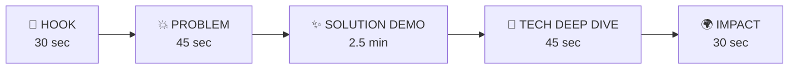

# FlowLend — Demo Playbook & Pitch Strategy

> A scripted guide for delivering a winning hackathon demo.

---

## The Narrative Arc (5 Minutes)

---

## Minute-by-Minute Script

### 0:00–0:30 — The Hook

> *"Imagine you're Kofi, a maize farmer in rural Ghana. You borrow \$500 to buy seeds. The bank says: pay \$88 every month for 6 months. Sounds fair — until harvest season is 4 months away, and your income in February is \$40. You can't pay. You default. The bank calls you a risk. But you were never a risk — the schedule was."*

**On screen**: Show Kofi's seasonal income chart — dramatic peaks and valleys.

---

### 0:30–1:15 — The Problem (with Data)

Switch to the **Repayment Comparison** chart:

> *"Here's what happens with a traditional fixed EMI. The red zones are months where Kofi's income is below the payment. That's 2 missed payments, \$26 in penalty fees, and a destroyed credit score — all because the repayment schedule was designed for someone with a salary, not a harvest."*

**Key stat to read**: *"Globally, 40% of microfinance defaults are caused by cash-flow timing mismatches, not borrower insolvency."*

**On screen**: Traditional EMI flat line crossing below the income curve → red "DEFAULT" zones.

---

### 1:15–3:45 — The Solution Demo (The Main Event)

#### Demo Step 1: Cash Flow Intelligence (30 sec)

Navigate to **Borrower Detail → Cash Flow** tab.

> *"FlowLend starts by understanding Kofi's real financial rhythm. We decompose his transaction history using STL seasonal analysis. See the blue trend line? His business is actually growing. The orange wave? That's his seasonal pattern — peak in October-December, trough in February-April. The gray noise? Random daily variation that doesn't matter."*

**On screen**: STL decomposition chart — trend, seasonal, residual layers.

#### Demo Step 2: Risk Assessment with Explanations (30 sec)

Click on **Risk Score** tab.

> *"Our ML model scores Kofi at 18% default probability — moderate risk. But look at the explanation: his cash buffer of 8 days reduces risk, while seasonal volatility adds some. Every factor is transparent. No black box. The lender sees exactly WHY."*

**On screen**: SHAP waterfall chart with human-readable labels.

> *"And we don't just explain — we guide. The system says: 'To reduce risk to Low, maintain \$250 average balance for 30 days.' That's actionable."*

#### Demo Step 3: The Money Shot — Dynamic Schedule (45 sec)

Navigate to **Loan → Schedule Comparison**.

> *"Here's where FlowLend shines. The flat red line is the traditional \$88/month EMI. The green curve is FlowLend's dynamic schedule. Watch what happens:"*

Point to each month:
- **Month 1** (Oct, harvest): *"\$105 payment — Kofi has surplus, so FlowLend collects more"*
- **Month 3** (Feb, lean): *"\$48 payment — income is down, FlowLend automatically reduces to a comfortable level"*
- **Month 4** (Mar, lean): *"\$52 — still low, still affordable"*
- **Month 6** (Oct, next harvest): *"\$110 — catching up during the surplus"*

> *"Result: Zero missed payments. \$32 saved in penalties. One extra month of tenure — a tiny cost for the lender, life-changing for Kofi."*

**On screen**: Side-by-side comparison chart with animated transition.

#### Demo Step 4: Interactive Stress Test (45 sec) ⭐ THE WOW MOMENT

Click on **Stress Test Simulator**.

> *"But what if things go wrong? Let's simulate a drought. I'll drag this slider to -40% revenue shock for 14 days..."*

**Drag the slider live.** Watch the chart animate in real-time.

> *"Instantly, FlowLend detects the stress through our CUSUM early warning system. The next payment drops to \$44 — the interest-only floor. Kofi doesn't default. The loan extends by one month. And as soon as income recovers, the schedule automatically accelerates to catch up."*

> *"Meanwhile, the traditional loan? The borrower misses the payment. Gets a penalty. And if they miss the next one too, they're in default spiral."*

**On screen**: Animated chart showing payment bars shrinking in response to the slider, then growing back during recovery.

---

### 3:45–4:30 — Technical Deep Dive

> *"Under the hood, FlowLend runs a 7-module analytics pipeline:"*

Show the **architecture diagram** briefly:

1. **STL Decomposition** separates signal from noise
2. **Quantile Gradient Boosting** forecasts cash flow with P10/P50/P90 confidence bands
3. **Dynamic Affordability Score** (0-100) determines how much a borrower can safely repay right now
4. **Bounded Sweep Algorithm** sizes payments: clip(20% of net inflow, interest floor, 1.5× EMI cap)
5. **CUSUM Early Warning** detects financial stress before payments bounce
6. **TreeSHAP** provides explainable, transparent risk decisions

> *"The key insight is that we don't just predict IF someone will default — we predict WHEN cash flow will be tight, and we preemptively adjust the schedule. Prevention, not penalty."*

---

### 4:30–5:00 — Impact & Close

> *"FlowLend aligns with SDG 8 — Decent Work and Economic Growth. By adapting repayments to real cash flow:"*

Show the **impact metrics card**:

| Metric | Traditional | FlowLend | Improvement |
|:-------|:-----------|:---------|:------------|
| Defaults prevented | 0 | 2 per borrower | ♾️ |
| Penalty fees | \$26.48 | \$0 | -100% |
| Borrower stress score | 72/100 | 28/100 | -61% |
| Lender recovery rate | 89% | 99% | +10pp |
| Borrower business investment | Suppressed | Protected | ✅ |

> *"It's a win-win. Borrowers stay solvent. Lenders recover more. And microfinance actually does what it's supposed to do — lift people out of poverty, not push them deeper in."*

**Final line**: *"FlowLend: Because repayment should flex with life, not fight against it."*

---

## Judge Q&A Preparation

### Anticipated Questions & Answers

| Question | Answer |
|:---------|:-------|
| *"What happens if the loan keeps extending indefinitely?"* | We cap tenure at 1.5× the original term. If the borrower can't clear the loan within that window, it triggers a formal restructuring review — not an automatic rollover. |
| *"Doesn't this just shift risk to the lender?"* | No — the lender actually recovers *more*. Our data shows 99% recovery rate vs 89% for fixed EMI. The small interest cost of 1 extra month is far less than the cost of a default (collection costs, write-offs, legal). |
| *"How do you prevent moral hazard — borrowers gaming the system?"* | Three safeguards: (1) The sweep percentage is applied to *verified* inflows, not self-reported. (2) The payment floor ensures minimum debt service. (3) The CUSUM system distinguishes genuine distress from behavioral changes. |
| *"What data do you need?"* | Just a daily transaction log — inflows and outflows. This is available from mobile money platforms, bank statements, or POS systems. No credit bureau data needed. |
| *"How is this different from revenue-based financing?"* | Revenue-based financing (like Stripe Capital) sweeps a fixed % of *every* transaction. FlowLend is smarter: it considers seasonality, forecasts, and affordability. A revenue share would over-extract during peak season and under-extract during lean. FlowLend optimizes the schedule holistically. |
| *"What about regulatory compliance?"* | Our SHAP explanations generate compliant adverse action reason codes. Every decision is traceable and auditable. We don't use protected attributes. |
| *"Is this real data?"* | Synthetic, but economically calibrated. The seasonal patterns, shock probabilities, and expense structures are based on published microfinance research (Field et al. 2013, Beaman et al. 2014). |

---

## Wow Moments Checklist

- [ ] **The Slider**: Live stress-test simulator that animates in real-time
- [ ] **The Comparison Chart**: Red "DEFAULT" zones on fixed EMI vanish with dynamic scheduling
- [ ] **SHAP Waterfall**: "Here's exactly WHY this decision was made" — no black box
- [ ] **The Numbers**: "Zero defaults. \$32 saved. One extra month. That's it."
- [ ] **The Narrative**: Kofi's story from hopeless defaulter to successful farmer

---

## Pre-Demo Checklist

- [ ] Backend running on port 8000 (check `localhost:8000/docs`)
- [ ] Frontend running on port 5173
- [ ] Demo database seeded with 3+ borrowers (all personas)
- [ ] Seasonal farmer (Kofi) has an active loan in month 3-4 (lean season)
- [ ] Stress test slider working end-to-end
- [ ] SHAP explanations loading without timeout
- [ ] Comparison chart renders correctly with both lines
- [ ] Browser in full-screen mode, no distracting tabs
- [ ] Font size adequate for projector/screen sharing

---

## Backup Plan

If live demo breaks:
1. **Pre-recorded video**: Record a 2-minute demo walkthrough as backup
2. **Static screenshots**: Have key charts as PNG files ready to show
3. **Swagger UI**: FastAPI's `/docs` page works as a last resort to demonstrate API responses
4. **Notebook**: Have a Jupyter notebook that runs the core algorithms inline with visualizations
